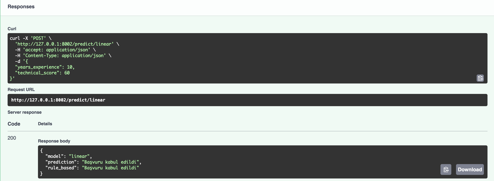

# Recruitment SVM Prediction 
İşe Alımda Aday Seçimi: SVM ile Başvuru Değerlendirme

Bu proje, adayların teknik puanı ve iş deneyimine göre işe alınıp alınmayacağına karar veren bir makine öğrenmesi uygulamasıdır. Model eğitimi, görselleştirme ve API ile tahmin yapma işlemleri Python ile gerçekleştirilmiştir.

## Projenin Amacı

Geçmiş verilere dayanarak bir adayın başvurusunun kabul edilip edilmeyeceğini tahmin eden bir sistem geliştirmektir. Veriler hem yapay olarak üretilmiş hem de gerçekçi dağılımlar kullanılarak çeşitlendirilmiştir. Model olarak dört farklı SVM (Support Vector Machine) algoritması kullanılmıştır.

## Proje Yapısı

```
.
├── generate_data.py              → Basit rastgele veriler üretir (uniform dağılım)
├── generate_data_faker.py        → Faker ve normal dağılım ile daha gerçekçi veriler üretir
├── train_svm_model.py            → 4 farklı SVM modelini eğitir ve .pkl dosyalarına kaydeder
├── api.py                        → FastAPI ile tahmin servisi sunar
├── models/                       → Eğitilmiş modellerin ve scaler'ın bulunduğu klasör
│   ├── svm_linear.pkl
│   ├── svm_rbf.pkl
│   ├── svm_poly.pkl
│   ├── svm_sigmoid.pkl
│   └── scaler.pkl
├── images/                       → Proje ekran görüntüleri
│   ├── models_images/            → Karar sınırı görselleri
│   └── swagger_ss/               → Swagger arayüzü görselleri
├── requirements.txt              → Proje bağımlılıkları
└── README.md                     → Proje açıklaması 
```

## Gereksinimler

Projeyi çalıştırmak için aşağıdaki Python kütüphanelerine ihtiyaç vardır:
- Python 3.9+
- fastapi
- uvicorn
- scikit-learn
- pandas
- numpy
- matplotlib
- faker
- joblib

Tüm gereksinimleri yüklemek için:
```bash
pip install -r requirements.txt
```

## Uygulama Nasıl Çalıştırılır?

### 1. Model Eğitimi:
```bash
python train_svm_model.py
```

### 2. API'yi Başlat:
```bash
uvicorn api:app --reload --port 8001
```

### 3. API'ye Erişim:
Tarayıcınızda açın:
```
http://localhost:8001/docs
```
Burada Swagger UI ile modeli test edebilirsiniz.

##  Kullanılan SVM Modelleri

- `linear`
- `rbf`
- `poly`
- `sigmoid`

Her biri  `endpoint` üzerinden test edilebilir:
```http
POST //predict/{model_name}
```

## Tahmin Açıklamaları

- `"prediction"`: Makine öğrenmesi modelinin kararı  
- `"rule_based"`: Önceden tanımlı basit kurala göre verilen karar  
  (örneğin: deneyim < 2 ve teknik puan < 60 → reddedilir)

## Swagger Arayüzü

Aşağıda Swagger UI arayüzünde API'nin nasıl test edildiğini gösteren ekran görüntüleri yer almaktadır:

### Linear Model ile Tahmin


### Ana Swagger Ekranı



## SVM Model Karar Sınırları

Aşağıda her bir SVM modelinin karar sınırı grafikleri yer almaktadır:

### Linear SVM


### Polynomial SVM


### RBF SVM


### Sigmoid SVM


Grafikler Hakkında Genel Yorum:

- Mavi noktalar (Class 0): İşe alınan adayları temsil ediyor
- Kırmızı noktalar (Class 1): İşe alınmayan adayları temsil ediyor
- Mavi bölgeler: İşe alınması önerilen bölgeler
- Pembe bölgeler: İşe alınmaması önerilen bölgeler
- Siyah çizgiler: Modelin belirlediği karar sınırları

- Sonuç olarak RBF nin en iyi dengeyi sağladığı ve filtrelemeyi yaptığı gözlemlenmiştir.

---

## Geliştiren
- **Proje Sahibi:** SEVGİ BERK SÜTBAŞ
- **Teslim Tarihi:** 21 Nisan 2025
